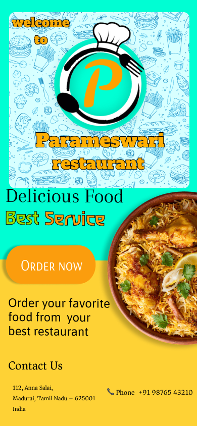

# 🍽️ Task 3 - Restaurant Menu UI

## Project
Parameswari Restaurant - Restaurant Menu Design

### Tools Used
- Figma
- UI/UX Design

### Features
- Modern Restaurant Branding
- Category Navigation
- Breakfast, Lunch & Dinner Sections
- Food Cards
- Contact Information
- Responsive Layout Concept

### Screenshots

#### Home Screen

#### Menu Page

#### Breakfast Menu

---

# Skills Applied

- User Interface Design
- User Experience Design
- Visual Hierarchy
- Typography
- Color Theory
- Branding
- Responsive Layout Design
- Prototyping
- Figma Components

---

## Tools

- Figma

---

## Internship

Completed as part of the **CodSoft UI/UX Internship Program**.
